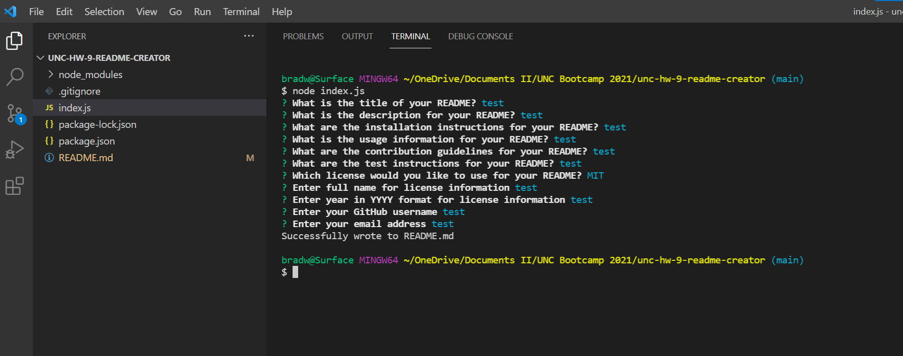
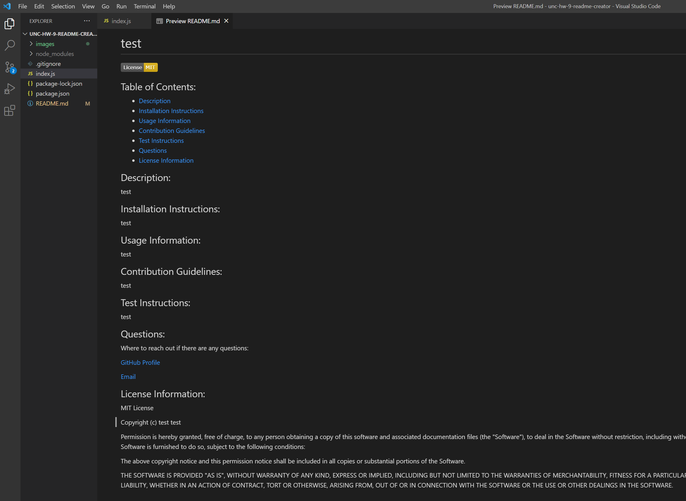

# README Creator

## A README creator that uses node and the inquirer npm

## Table of Contents

- [Motivation and Technologies](#motivation)
- [Functionality](#functionality)
- [Challenges](#challenges)
- [Usage](#usage)

## Motivation

The goal of this project is to showcase the power of inquirer npm and create a full README file using the prompts filled in by the user in the terminal.

#### Technologies

- Javascript
- node.js
- Inquirer NPM

## Functionality

#### The screenshot shows the input a user would put into the terminal and the README file created

- The user will be prompted to answer questions in teh terminal that will be used to fill in the README file.
- The README is created with the information from the prompts.

## Challenges

The major challenges faced when creating this application was how to implement the license badge into the README file. I was stuck for awhile trying to figure out how to input something that came from a function into the README, but once that was figured out it was pretty much smooth sailing from there.

## Usage

- Being able to quickly and efficiently create a README that follows a specific format.

## Future Development

- Recreate the prompts to match closer to the format of this README file so that I can use it in the future.
